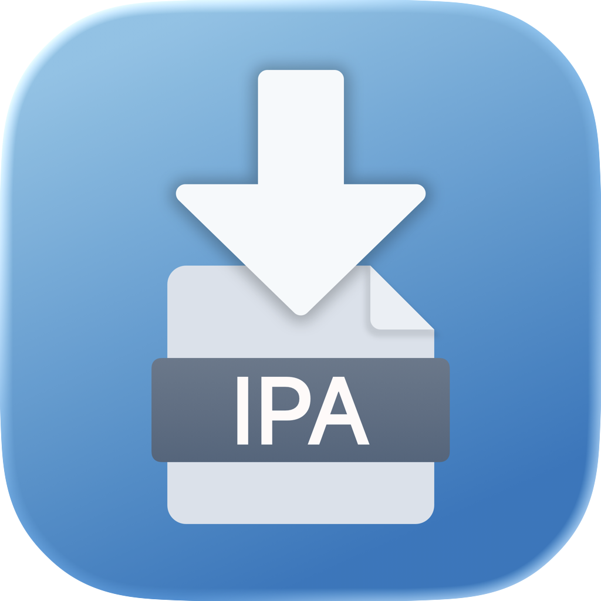
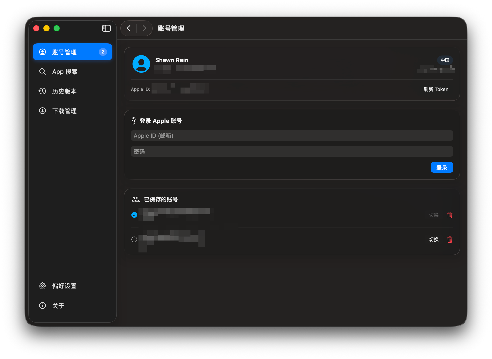
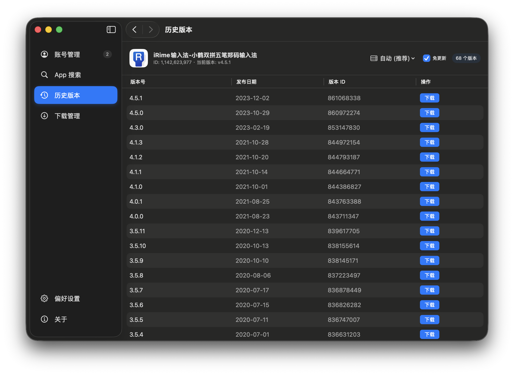

# ipaDown for Mac

> This is a vibe-coded project.
> Developed with ❤️ using **Antigravity**.



**A .ipa download tool developed in Swift for macOS App Store.**

[简体中文](./README_zh-CN.md) | [English](./README.md)

<br>


---

## 📸 Interface Preview

<p align="center">
  
  
</p>

---

## 📖 Introduction

**ipaDown for Mac** is a professional download tool designed to fetch `.ipa` files directly from the App Store.

> 💡 **Inspiration**
> This project is inspired by the **ipaDown Windows version** released on the **52pojie forum**. Our mission is to migrate and enhance its core functionalities natively for the macOS ecosystem, providing a seamless experience for Apple users.

Powered by standard system APIs and `aria2`, it offers a clean, native UI while ensuring high-performance downloads.

## ✨ Features

- **Native Experience**: Built with SwiftUI for a smooth, responsive macOS interface.
- **Account Management**: Support for multiple Apple IDs and quick switching between Storefront regions.
- **Advanced Search**: Search for apps and retrieve historical version IDs effortlessly.
- **High-Speed Download**: Integrated `aria2` backend for multi-threaded, resume-supported downloads.
- **Auto-Refresh**: Automatic token refreshing to keep your sessions active.
- **System Integration**: Native notifications and AirDrop support for sharing downloaded IPAs.
- **Automatic Updates**: Integrated Sparkle framework to keep you on the latest version.

## 📦 Installation

### Download Binary
Download the latest `.dmg` installer from the [Releases](https://github.com/ShawnRn/ipaDown-for-Mac/releases) page.

### Build from Source

1. **Clone the repository**
   ```bash
   git clone https://github.com/ShawnRn/ipaDown-for-Mac.git
   cd ipaDown-for-Mac
   ```

2. **Open the project**
   Open `ipaDown-for-Mac.xcodeproj` in Xcode.

3. **Build and Run**
   Select the `ipaDown` scheme and hit `Cmd + R` to run.

## 🛠 Tech Stack

- **UI**: SwiftUI (macOS 13.0+)
- **Core**: Swift 5.9+
- **Network**: aria2c (embedded)
- **Update**: Sparkle
- **Reference**: Uses strictly typed, safe Swift concurrency models.

## 📝 License

This project is licensed under the [MIT License](LICENSE).

---

<p align="center">
  Made with ❤️ by Shawn Rain
</p>
